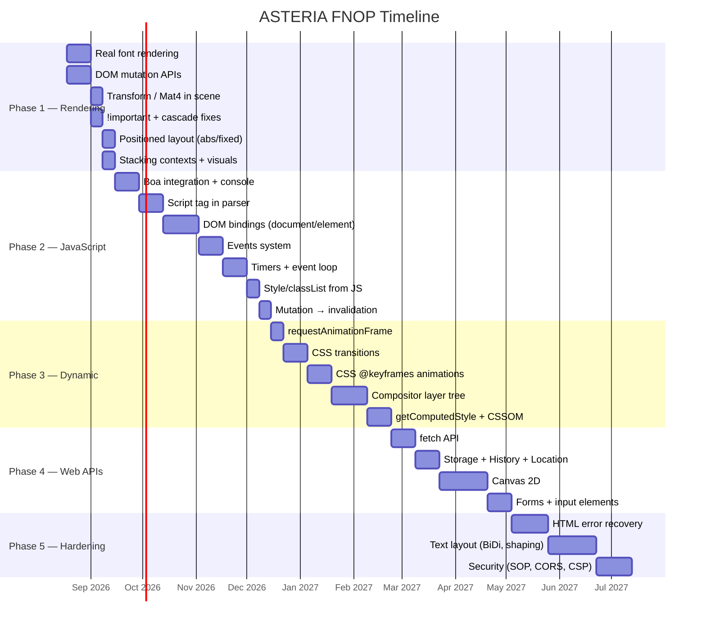

# FNOP — From Now On Plan

**ASTERIA Browser Engine — Next Phase Roadmap**
**Created:** 11 August 2026
**Status:** Draft — awaiting review

---

## Where We Are Right Now

ASTERIA has a **working end-to-end pipeline**: Network → HTML Tokenizer → Parser → DOM (arena) → CSS Parser → Style Engine (cascade, inheritance, 33 properties) → Layout (Block, Inline, Flex, Grid) → Paint (display list) → Scene Graph (SoA, tile segments) → wgpu GPU Renderer.

What's working is real. What's missing is what turns a document renderer into a web platform.

### Current Capability Snapshot

```
✅ Solid    HTML tokenizer, parser, arena DOM (zero-copy offsets)
✅ Solid    CSS tokenizer + parser (33 longhands, 6 categories)
✅ Strong   Style engine (cascade, specificity, @media, var(), inheritance)
✅ Good     Layout (BFC, IFC line-wrap, Flex row/wrap/gap, Grid fr/px/%/span)
✅ Basic    Paint (display list, bg→border→content ordering)
✅ Novel    Scene graph (SoA, 256px tile segments, dirty propagation, hit testing)
✅ Working  wgpu renderer (WGSL shaders, render graph, RectPass/TextPass/ImagePass)
✅ Advanced Scheduler (priority queue, thread pool, panic isolation, adaptive scaling)
✅ Working  Shell (tabs, history, navigation, events)
✅ Working  Loader (file + HTTP, inline <style>, external <link> discovery)
⚠️ Stub    Animation (lerp/ease functions only, no active timelines)
⚠️ Heuristic  Text measurement (len * font_size * 0.55 — no real shaping)
❌ Missing  JavaScript engine
❌ Missing  DOM mutation APIs (DOM is read-only after parse)
❌ Missing  CSS transforms in scene graph (no Mat4)
❌ Missing  Real font rendering (5×7 ASCII bitmap only)
❌ Missing  Stacking contexts, border-radius, box-shadow, gradients
❌ Missing  !important, ::before/::after, calc()
❌ Missing  Absolute/fixed positioning offsets
❌ Missing  Image/font/script resource pipelines
```

---

## Plan Overview

```
Phase 1 ─ Rendering Foundation          ~6 weeks
Phase 2 ─ JavaScript Integration        ~10-14 weeks
Phase 3 ─ Dynamic Rendering             ~8-12 weeks
Phase 4 ─ Web Platform APIs             ~8-12 weeks
Phase 5 ─ Compliance & Hardening        ~8-12 weeks
Phase 6 ─ Advanced Platform             Ongoing
```



---

## Phase 1 — Rendering Foundation

**Goal:** Close the critical gaps that make every website look broken, and prepare the DOM for JavaScript mutation.

**Duration:** ~6 weeks

> [!IMPORTANT]
> This phase must be completed before JavaScript integration. JS bindings call DOM mutation APIs. The compositor needs Mat4 for transforms. Fonts must work for any visual testing to be meaningful.

---

### 1.1 Real Font Rendering

**Problem:** The renderer uses a hardcoded 5×7 ASCII bitmap font. No website looks readable.

**Solution:** Connect Glyphon (already in `Cargo.toml` as `glyphon = "0.6"`) to real TTF/OTF font files.

| Task | File(s) | Details |
|---|---|---|
| Font loading from system paths | [fonts.rs](file:///Users/anzalkabeer/asteria/main/src/text/fonts.rs) [NEW] | Scan `/System/Library/Fonts/` (macOS), `/usr/share/fonts/` (Linux), load `.ttf`/`.otf` |
| Font cache | [font_cache.rs](file:///Users/anzalkabeer/asteria/main/src/text/font_cache.rs) [NEW] | LRU cache keyed by (family, weight, style) → loaded font handle |
| Integrate Glyphon `TextArea` API | [text_pass.rs](file:///Users/anzalkabeer/asteria/main/src/renderer/passes/) [MODIFY] | Replace 5×7 bitmap vertex generation with Glyphon's `TextArea` + `TextRenderer` |
| Text measurement from Glyphon | [layout.rs](file:///Users/anzalkabeer/asteria/main/src/layout.rs) [MODIFY] | Replace `len * font_size * 0.55` heuristic with actual glyph-based measurement |
| CSS `@font-face` parsing | [css_parser.rs](file:///Users/anzalkabeer/asteria/main/src/css_parser.rs) [MODIFY] | Parse `@font-face` rules into `FontFaceDescriptor` structs |
| Font download pipeline | [loader.rs](file:///Users/anzalkabeer/asteria/main/src/loader.rs) [MODIFY] | Add `ResourceType::Font`, fetch WOFF2/TTF from URLs |

**Test:** Render a page with `font-family: serif, sans-serif, monospace` and visually confirm text is readable and correctly measured.

---

### 1.2 DOM Mutation APIs

**Problem:** The DOM is currently append-only during parsing. No runtime modification is possible. JavaScript needs to call `appendChild`, `removeChild`, `setAttribute`, etc.

**Solution:** Add mutation methods to `Dom` struct that also set dirty flags.

| Task | File(s) | Details |
|---|---|---|
| `Dom::create_element(tag) -> NodeId` | [dom.rs](file:///Users/anzalkabeer/asteria/main/src/dom.rs) [MODIFY] | Allocate new Element node in arena with owned string (not zero-copy — runtime nodes don't have a source buffer) |
| `Dom::create_text(text) -> NodeId` | [dom.rs](file:///Users/anzalkabeer/asteria/main/src/dom.rs) [MODIFY] | Allocate new Text node with owned content |
| `Dom::append_child(parent, child)` | [dom.rs](file:///Users/anzalkabeer/asteria/main/src/dom.rs) [MODIFY] | Add to parent's children vec, set child's parent, mark dirty |
| `Dom::remove_child(parent, child)` | [dom.rs](file:///Users/anzalkabeer/asteria/main/src/dom.rs) [MODIFY] | Remove from parent's children, clear child's parent, mark dirty |
| `Dom::insert_before(parent, new, ref)` | [dom.rs](file:///Users/anzalkabeer/asteria/main/src/dom.rs) [MODIFY] | Insert at specific position in children vec |
| `Dom::set_attribute(node, name, value)` | [dom.rs](file:///Users/anzalkabeer/asteria/main/src/dom.rs) [MODIFY] | Add/update attribute (owned strings for runtime attrs) |
| `Dom::remove_attribute(node, name)` | [dom.rs](file:///Users/anzalkabeer/asteria/main/src/dom.rs) [MODIFY] | Remove attribute by name |
| `Dom::set_text_content(node, text)` | [dom.rs](file:///Users/anzalkabeer/asteria/main/src/dom.rs) [MODIFY] | Clear children, set text content, mark dirty |
| `Dom::get_text_content(node) -> String` | [dom.rs](file:///Users/anzalkabeer/asteria/main/src/dom.rs) [MODIFY] | Recursive text collection from subtree |
| `Dom::query_selector(root, selector)` | [dom.rs](file:///Users/anzalkabeer/asteria/main/src/dom.rs) [MODIFY] | Walk tree, match against CSS selector using existing selector matcher |
| `Dom::query_selector_all(root, selector)` | [dom.rs](file:///Users/anzalkabeer/asteria/main/src/dom.rs) [MODIFY] | Same but collects all matches |
| `Dom::get_element_by_id(root, id)` | [dom.rs](file:///Users/anzalkabeer/asteria/main/src/dom.rs) [MODIFY] | Optimized ID lookup — add `id_index: HashMap<String, NodeId>` to Dom |

> [!NOTE]
> **ASTERIA-specific concern:** Your current `NodeKind::Element { tag_start, tag_end }` stores byte offsets into the HTML source buffer (zero-copy). Runtime-created elements won't have a source buffer. You'll need a hybrid approach. **Recommended:** Use your existing `Interner` (18KB of code already written!) to intern all tag names — both parsed and runtime. This preserves cache locality and works for both cases.

**Test:** Unit test that creates a DOM from HTML, then programmatically appends/removes/modifies nodes, and the tree prints correctly.

---

### 1.3 CSS Transform Support in Scene Graph

**Problem:** `SceneNode` has no transform matrix. CSS `transform: translate/rotate/scale/perspective` cannot work.

**Solution:** Add `Mat4` transforms and propagate through the compositor.

| Task | File(s) | Details |
|---|---|---|
| Add `transform: [f32; 16]` to `SceneNode` | [scene.rs](file:///Users/anzalkabeer/asteria/main/src/scene.rs) [MODIFY] | 4×4 matrix, identity by default |
| Parse CSS `transform` property | [css_parser.rs](file:///Users/anzalkabeer/asteria/main/src/css_parser.rs) + [values.rs](file:///Users/anzalkabeer/asteria/main/src/values.rs) [MODIFY] | Parse `translate(x,y)`, `rotate(deg)`, `scale(x,y)`, `translate3d`, `rotateX/Y/Z`, `perspective`, `matrix3d` |
| Add `transform` to `ComputedStyle` | [values.rs](file:///Users/anzalkabeer/asteria/main/src/values.rs) [MODIFY] | Store as `Vec<TransformFunction>` |
| Build transform matrix during paint | [paint.rs](file:///Users/anzalkabeer/asteria/main/src/paint.rs) [MODIFY] | Convert `Vec<TransformFunction>` → `[f32; 16]` by multiplying matrices |
| Apply transforms in GPU pass | [renderer/passes/](file:///Users/anzalkabeer/asteria/main/src/renderer/passes/) [MODIFY] | Upload per-node transform as uniform; multiply in vertex shader |
| Transform-aware hit testing | [scene.rs](file:///Users/anzalkabeer/asteria/main/src/scene.rs) [MODIFY] | Inverse-transform mouse coordinates before checking bounds |

**Test:** Render `<div style="transform: rotate(45deg)">Hello</div>` — the box should be visibly rotated.

---

### 1.4 Cascade Fixes

| Task | File(s) | Details |
|---|---|---|
| `!important` rule support | [style.rs](file:///Users/anzalkabeer/asteria/main/src/style.rs) [MODIFY] | Parse `!important` flag on declarations. Important author declarations beat normal author in cascade sort. |
| `::before` / `::after` pseudo-elements | [style.rs](file:///Users/anzalkabeer/asteria/main/src/style.rs) + [layout.rs](file:///Users/anzalkabeer/asteria/main/src/layout.rs) [MODIFY] | Generate pseudo-element nodes during style resolution. Insert as first/last child in layout tree. Requires `content` property parsing. |
| `calc()` expressions | [values.rs](file:///Users/anzalkabeer/asteria/main/src/values.rs) [MODIFY] | Parse `calc(100% - 20px)` into an expression tree. Resolve at computed value time when percentage basis is known. |

**Test:** `div { width: calc(100% - 40px) !important; }` should override any non-important width.

---

### 1.5 Positioned Layout

**Problem:** `position: absolute` and `position: fixed` are parsed but the layout engine doesn't apply `top/right/bottom/left` offsets.

| Task | File(s) | Details |
|---|---|---|
| Parse `top`, `right`, `bottom`, `left` | [css_parser.rs](file:///Users/anzalkabeer/asteria/main/src/css_parser.rs) + [values.rs](file:///Users/anzalkabeer/asteria/main/src/values.rs) [MODIFY] | Add to property set, support `px`, `%`, `auto` |
| Add offset fields to `ComputedStyle` | [values.rs](file:///Users/anzalkabeer/asteria/main/src/values.rs) [MODIFY] | `top: Option<f32>`, `right: Option<f32>`, etc. |
| Absolute positioning in layout | [layout.rs](file:///Users/anzalkabeer/asteria/main/src/layout.rs) [MODIFY] | Position relative to containing block (nearest positioned ancestor). Remove from normal flow. |
| Fixed positioning in layout | [layout.rs](file:///Users/anzalkabeer/asteria/main/src/layout.rs) [MODIFY] | Position relative to viewport. Remove from normal flow. |
| `z-index` property | [values.rs](file:///Users/anzalkabeer/asteria/main/src/values.rs) + [style.rs](file:///Users/anzalkabeer/asteria/main/src/style.rs) [MODIFY] | Parse integer z-index, `auto` value |

**Test:** `<div style="position: absolute; top: 50px; left: 100px;">Positioned</div>` should appear at (100, 50) regardless of surrounding content.

---

### 1.6 Visual Polish

| Task | File(s) | Details |
|---|---|---|
| Stacking contexts | [paint.rs](file:///Users/anzalkabeer/asteria/main/src/paint.rs) + [scene.rs](file:///Users/anzalkabeer/asteria/main/src/scene.rs) [MODIFY] | Create stacking context for positioned elements with z-index, opacity < 1, transform. Sort children by z-order within context. |
| `border-radius` | [values.rs](file:///Users/anzalkabeer/asteria/main/src/values.rs) + [renderer/](file:///Users/anzalkabeer/asteria/main/src/renderer/) [MODIFY] | Parse `border-radius`. Clip corners in shader (SDF-based rounded rect). |
| `box-shadow` | [values.rs](file:///Users/anzalkabeer/asteria/main/src/values.rs) + [paint.rs](file:///Users/anzalkabeer/asteria/main/src/paint.rs) [MODIFY] | Parse `box-shadow: offsetX offsetY blur spread color`. Render as blurred rect behind element. |
| `opacity` property | [values.rs](file:///Users/anzalkabeer/asteria/main/src/values.rs) + [scene.rs](file:///Users/anzalkabeer/asteria/main/src/scene.rs) [MODIFY] | Parse 0.0-1.0 value. Multiply into `colors[]` alpha in scene graph. |
| `overflow: hidden/scroll/auto` | [values.rs](file:///Users/anzalkabeer/asteria/main/src/values.rs) + [layout.rs](file:///Users/anzalkabeer/asteria/main/src/layout.rs) [MODIFY] | Parse overflow. Clip children to parent bounds during paint. |
| Linear gradients | [values.rs](file:///Users/anzalkabeer/asteria/main/src/values.rs) + [renderer/](file:///Users/anzalkabeer/asteria/main/src/renderer/) [MODIFY] | Parse `linear-gradient(direction, color-stops)`. Generate gradient in fragment shader. |

**Test:** Render a card with `border-radius: 12px; box-shadow: 0 4px 12px rgba(0,0,0,0.15); opacity: 0.9;` — should look like a modern UI card.

---

### Phase 1 Verification

```bash
# Build and run rendering test suite
cargo test --lib test_dom_mutation
cargo test --lib test_transform_matrix
cargo test --lib test_cascade_important
cargo test --lib test_positioned_layout

# Visual regression: render test pages, compare screenshots
cargo run -- tests/rendering/01-fonts.html
cargo run -- tests/rendering/02-transforms.html
cargo run -- tests/rendering/03-positioned.html
cargo run -- tests/rendering/04-visual-polish.html
```

---

## Phase 2 — JavaScript Integration

**Goal:** Execute JavaScript, manipulate the DOM from scripts, handle user events, and build the browser event loop.

**Duration:** ~10-14 weeks

**Depends on:** Phase 1 (DOM mutation APIs, dirty flags)

> [!IMPORTANT]
> This is the single largest phase in the entire plan. It touches nearly every subsystem and fundamentally changes ASTERIA from a document renderer into a web platform. The hardest part is NOT integrating Boa — it's building the binding layer between JavaScript objects and your Rust DOM.

---

### 2.1 Boa Engine Integration

| Task | File(s) | Details |
|---|---|---|
| Add `boa_engine` to dependencies | [Cargo.toml](file:///Users/anzalkabeer/asteria/main/Cargo.toml) [MODIFY] | `boa_engine = "0.20"` (or latest stable) |
| Create JS runtime module | `src/javascript/mod.rs` [NEW] | Module root, re-exports |
| `JsRuntime` struct | `src/javascript/runtime.rs` [NEW] | Wraps `boa_engine::Context`. Provides `eval(script: &str)` method. Holds reference to DOM via `Rc<RefCell<Dom>>` or similar shared ownership. |
| `console.log()` binding | `src/javascript/console.rs` [NEW] | Register `console` object on global with `log`, `warn`, `error`, `info` methods. Output to stderr/stdout. |

**Test:**
```html
<script>
    let x = 10;
    console.log("ASTERIA JS:", x * 2);
</script>
```
Should print `ASTERIA JS: 20` to the console.

---

### 2.2 Script Tag Handling in Parser

**Problem:** When the parser encounters `<script>`, it must **pause**, execute the script, and then **resume**. JavaScript can call `document.write()` which injects new HTML into the token stream.

| Task | File(s) | Details |
|---|---|---|
| Detect `<script>` during parsing | [parser.rs](file:///Users/anzalkabeer/asteria/main/src/parser.rs) [MODIFY] | When parser sees `<script>` open tag, switch to script-collection mode |
| Collect script content | [parser.rs](file:///Users/anzalkabeer/asteria/main/src/parser.rs) [MODIFY] | Buffer all text until `</script>`. Handle inline scripts. |
| `<script src="...">` loading | [loader.rs](file:///Users/anzalkabeer/asteria/main/src/loader.rs) [MODIFY] | Add `ResourceType::Script`. Fetch external JS files via ResourceLoader. |
| Pause parser → execute → resume | [parser.rs](file:///Users/anzalkabeer/asteria/main/src/parser.rs) + `src/javascript/runtime.rs` [MODIFY] | Parser yields a `PendingScript` event. Main pipeline executes script, then resumes parser. |
| `defer` attribute | [parser.rs](file:///Users/anzalkabeer/asteria/main/src/parser.rs) [MODIFY] | Collect deferred scripts, execute after parsing completes (before `DOMContentLoaded`). |
| `async` attribute | [parser.rs](file:///Users/anzalkabeer/asteria/main/src/parser.rs) + [scheduler.rs](file:///Users/anzalkabeer/asteria/main/src/scheduler.rs) [MODIFY] | Download in background, execute when ready (doesn't block parser). |
| `document.write()` support | `src/javascript/bindings/document.rs` [NEW] | Injects HTML string into the parser's token stream at current insertion point. |

> [!WARNING]
> **ASTERIA-specific concern:** Your streaming parser (`StreamingHtmlProcessor`) processes chunks asynchronously. `<script>` tag handling breaks this model — the parser must synchronously block until the script executes. **Recommended approach:** Make the parser synchronous for now (process full document, pause at scripts). Refactor to a coroutine/yield-based approach later to preserve your streaming advantage.

**Test:**
```html
<div id="before">Before</div>
<script>
    document.write("<p>Injected by JS</p>");
</script>
<div id="after">After</div>
```
Should render: "Before", "Injected by JS", "After" in that order.

---

### 2.3 DOM Bindings

The binding layer between Boa's JavaScript objects and your Rust DOM.

| Task | File(s) | Details |
|---|---|---|
| `window` global object | `src/javascript/bindings/window.rs` [NEW] | Global scope. Properties: `document`, `innerWidth`, `innerHeight`, `location`, `navigator` (stubs). |
| `document` object | `src/javascript/bindings/document.rs` [NEW] | `querySelector(sel)`, `querySelectorAll(sel)`, `getElementById(id)`, `createElement(tag)`, `createTextNode(text)`, `body`, `head`, `title`, `documentElement` |
| `HTMLElement` prototype | `src/javascript/bindings/element.rs` [NEW] | `textContent` (get/set), `innerHTML` (get/set), `setAttribute()`, `getAttribute()`, `removeAttribute()`, `appendChild()`, `removeChild()`, `insertBefore()`, `replaceChild()`, `children`, `parentElement`, `nextSibling`, `previousSibling`, `tagName`, `id`, `className` |
| Node identity mapping | `src/javascript/bindings/node_map.rs` [NEW] | Maps `NodeId` ↔ Boa `JsObject`. Ensures `querySelector("#x") === querySelector("#x")` identity. Uses `HashMap<NodeId, JsObject>`. |
| `Node` base prototype | `src/javascript/bindings/node.rs` [NEW] | `nodeType`, `nodeName`, `nodeValue`, `childNodes`, `firstChild`, `lastChild`, `parentNode`, `cloneNode()` |

> [!NOTE]
> **ASTERIA-specific advantage:** Your `NodeId(u32)` arena approach means JS ↔ DOM binding is a simple integer lookup, not pointer chasing. The `NodeMap<NodeId, JsObject>` cache gives you identity semantics without reference counting on the DOM side. This is actually simpler and faster than Chrome's approach.

**Test:**
```html
<div id="app">Old text</div>
<script>
    const app = document.getElementById("app");
    app.textContent = "Hello from ASTERIA JS!";
</script>
```
Should render "Hello from ASTERIA JS!" inside the div.

---

### 2.4 Events System

| Task | File(s) | Details |
|---|---|---|
| `EventTarget` trait/base | `src/javascript/events/event_target.rs` [NEW] | `addEventListener(type, callback, options)`, `removeEventListener(type, callback)`, `dispatchEvent(event)` |
| `Event` object | `src/javascript/events/event.rs` [NEW] | `type`, `target`, `currentTarget`, `bubbles`, `cancelable`, `defaultPrevented`, `stopPropagation()`, `preventDefault()`, `eventPhase` |
| Event propagation (capture + bubble) | `src/javascript/events/dispatch.rs` [NEW] | Walk ancestor chain (capture phase, top-down), fire at target, then bubble (bottom-up). Respect `stopPropagation()`. |
| `MouseEvent` | `src/javascript/events/mouse.rs` [NEW] | `clientX`, `clientY`, `offsetX`, `offsetY`, `button`, `buttons` |
| `KeyboardEvent` | `src/javascript/events/keyboard.rs` [NEW] | `key`, `code`, `altKey`, `ctrlKey`, `shiftKey`, `metaKey` |
| Wire Winit events → DOM events | [window.rs](file:///Users/anzalkabeer/asteria/main/src/renderer/window/window.rs) [MODIFY] | Mouse click → hit test → find DOM node → dispatch `click` event. Key press → dispatch `keydown`/`keyup`. |
| `DOMContentLoaded` event | `src/javascript/events/` [NEW] | Dispatch on `document` after parsing completes and deferred scripts run. |
| `load` event | `src/javascript/events/` [NEW] | Dispatch on `window` after all resources loaded. |

**Test:**
```html
<button id="btn">Click me</button>
<p id="output">Waiting...</p>
<script>
    document.getElementById("btn").addEventListener("click", function() {
        document.getElementById("output").textContent = "Button clicked!";
    });
</script>
```
Clicking the button should change the paragraph text.

---

### 2.5 Timers & Event Loop

| Task | File(s) | Details |
|---|---|---|
| `setTimeout(callback, ms)` | `src/javascript/timers.rs` [NEW] | Returns timer ID. Schedules callback on task queue after delay. |
| `setInterval(callback, ms)` | `src/javascript/timers.rs` [NEW] | Repeating timer. Returns ID. |
| `clearTimeout(id)` / `clearInterval(id)` | `src/javascript/timers.rs` [NEW] | Cancel pending timer by ID. |
| Task queue | `src/javascript/event_loop.rs` [NEW] | FIFO queue of pending JS tasks (timer callbacks, event handlers, script execution). |
| Microtask queue | `src/javascript/event_loop.rs` [NEW] | Separate queue for Promise `.then()` callbacks, `queueMicrotask()`. Drained completely after each task. |
| Event loop integration | [window.rs](file:///Users/anzalkabeer/asteria/main/src/renderer/window/window.rs) [MODIFY] | Each frame: drain task queue → drain microtask queue → rAF callbacks → render. |
| `Promise` support | Via Boa | Boa provides Promise natively. Wire `.then()` callbacks to microtask queue. |

> [!NOTE]
> **ASTERIA-specific concern:** Your existing `ThreadedScheduler` runs tasks on background threads. The JS event loop is **single-threaded** on the main thread. These are two different scheduling systems that coexist. Background tasks (network fetches, resource loading) produce results that get queued as tasks on the main-thread event loop.

**Test:**
```html
<script>
    console.log("A");
    setTimeout(() => console.log("D"), 0);
    Promise.resolve().then(() => console.log("B"));
    console.log("C");
</script>
```
Must print: `A`, `C`, `B`, `D` — in that exact order.

---

### 2.6 Style Manipulation from JS

| Task | File(s) | Details |
|---|---|---|
| `element.style` property | `src/javascript/bindings/element.rs` [MODIFY] | Returns a `CSSStyleDeclaration` proxy. Getting/setting properties reads/writes inline style. |
| `element.classList` | `src/javascript/bindings/classlist.rs` [NEW] | `add()`, `remove()`, `toggle()`, `contains()`, `replace()`. Modifies the `class` attribute. |
| `element.className` | `src/javascript/bindings/element.rs` [MODIFY] | Get/set the full class string. |

---

### 2.7 Mutation → Invalidation Pipeline

This is what makes the screen actually update when JS changes the DOM.

| Task | File(s) | Details |
|---|---|---|
| DOM mutation → dirty flags | [dom.rs](file:///Users/anzalkabeer/asteria/main/src/dom.rs) [MODIFY] | Every mutation method sets `needs_style = true` on affected node + ancestors. Structural changes also set `needs_layout = true`. |
| Re-style dirty subtrees | [style.rs](file:///Users/anzalkabeer/asteria/main/src/style.rs) [MODIFY] | `restyle_dirty(root, stylesheet)` — only recompute style for nodes with `needs_style`. |
| Re-layout dirty subtrees | [layout.rs](file:///Users/anzalkabeer/asteria/main/src/layout.rs) [MODIFY] | `relayout_dirty(root)` — only recompute layout for subtrees with `needs_layout`. |
| Re-paint dirty regions | [paint.rs](file:///Users/anzalkabeer/asteria/main/src/paint.rs) + [scene.rs](file:///Users/anzalkabeer/asteria/main/src/scene.rs) [MODIFY] | Regenerate display commands and scene nodes only for dirty tile segments. |
| Frame-level dirty check | [window.rs](file:///Users/anzalkabeer/asteria/main/src/renderer/window/window.rs) [MODIFY] | Only request GPU redraw if any dirty flags are set. Don't burn GPU on static pages. |

**Test:**
```html
<div id="box" style="width:100px;height:100px;background:blue;"></div>
<script>
    setTimeout(() => {
        document.getElementById("box").style.backgroundColor = "red";
    }, 1000);
</script>
```
Box should be blue for 1 second, then turn red — without full page re-render.

---

### Phase 2 Verification

```bash
cargo test --lib test_js_runtime
cargo test --lib test_dom_bindings
cargo test --lib test_events
cargo test --lib test_event_loop_ordering
cargo test --lib test_mutation_invalidation

# Integration tests
cargo run -- tests/js/01-console.html
cargo run -- tests/js/02-dom-manipulation.html
cargo run -- tests/js/03-events.html
cargo run -- tests/js/04-timers.html
cargo run -- tests/js/05-dynamic-style.html
```

---

## Phase 3 — Dynamic Rendering & Animation

**Goal:** Make ASTERIA capable of smooth, 60fps animations driven by both CSS and JavaScript.

**Duration:** ~8-12 weeks

**Depends on:** Phase 2 (event loop, DOM bindings, style manipulation)

---

### 3.1 requestAnimationFrame

| Task | File(s) | Details |
|---|---|---|
| `requestAnimationFrame(callback)` binding | `src/javascript/bindings/window.rs` [MODIFY] | Register callback. Returns ID. |
| `cancelAnimationFrame(id)` | `src/javascript/bindings/window.rs` [MODIFY] | Remove callback by ID. |
| rAF callback execution in frame loop | `src/javascript/event_loop.rs` + [window.rs](file:///Users/anzalkabeer/asteria/main/src/renderer/window/window.rs) [MODIFY] | Each frame: run rAF callbacks (passing `DOMHighResTimeStamp`) → process style/layout/paint → present. |
| Integration with `FrameBudget` | [frame.rs](file:///Users/anzalkabeer/asteria/main/src/frame.rs) [MODIFY] | Add `js_ms` stage for tracking JS execution time within the frame budget. |

**Test:**
```html
<div id="ball" style="width:30px;height:30px;background:red;position:absolute;"></div>
<script>
    let x = 0;
    function animate(t) {
        x = (x + 2) % 500;
        document.getElementById("ball").style.left = x + "px";
        requestAnimationFrame(animate);
    }
    requestAnimationFrame(animate);
</script>
```
Red ball should move smoothly across the screen at 60fps.

---

### 3.2 CSS Transitions

| Task | File(s) | Details |
|---|---|---|
| Parse `transition` shorthand | [css_parser.rs](file:///Users/anzalkabeer/asteria/main/src/css_parser.rs) + [values.rs](file:///Users/anzalkabeer/asteria/main/src/values.rs) [MODIFY] | `transition: property duration timing-function delay` |
| Parse individual longhands | [values.rs](file:///Users/anzalkabeer/asteria/main/src/values.rs) [MODIFY] | `transition-property`, `transition-duration`, `transition-timing-function`, `transition-delay` |
| Transition state tracker | [animation.rs](file:///Users/anzalkabeer/asteria/main/src/animation.rs) [MODIFY] | `ActiveTransition { property, from, to, start_time, duration, timing_fn }` |
| Detect triggering style changes | [style.rs](file:///Users/anzalkabeer/asteria/main/src/style.rs) [MODIFY] | When computed value changes for a transitioned property, start transition instead of snapping |
| Per-frame interpolation | [animation.rs](file:///Users/anzalkabeer/asteria/main/src/animation.rs) [MODIFY] | Use existing `lerp`/`ease` functions. Compute interpolated value each frame. |
| Transitionable properties | [animation.rs](file:///Users/anzalkabeer/asteria/main/src/animation.rs) [MODIFY] | Start with: `opacity`, `color`, `background-color`, `width`, `height`, `margin-*`, `padding-*`, `transform`, `top/right/bottom/left` |

**Test:** Color transition from blue to red over 0.5 seconds should be smooth, not a snap.

---

### 3.3 CSS @keyframes Animations

| Task | File(s) | Details |
|---|---|---|
| Parse `@keyframes` rules | [css_parser.rs](file:///Users/anzalkabeer/asteria/main/src/css_parser.rs) [MODIFY] | Parse keyframe name, percentage stops, declarations |
| Keyframe storage | [values.rs](file:///Users/anzalkabeer/asteria/main/src/values.rs) [MODIFY] | `Keyframe { offset, declarations }`, `KeyframeAnimation { name, keyframes }` |
| Wire existing animation properties | [style.rs](file:///Users/anzalkabeer/asteria/main/src/style.rs) [MODIFY] | Connect already-parsed `animation-name`, `animation-duration`, `animation-timing-function`, `animation-iteration-count` to playback |
| Animation timeline player | [animation.rs](file:///Users/anzalkabeer/asteria/main/src/animation.rs) [MODIFY] | `AnimationTimeline { keyframes, current_time, duration, iteration_count, direction, fill_mode }` |
| Per-frame keyframe interpolation | [animation.rs](file:///Users/anzalkabeer/asteria/main/src/animation.rs) [MODIFY] | Find surrounding keyframe pair, interpolate all animated properties |
| Connect to `AnimationManager.tick()` | [animation.rs](file:///Users/anzalkabeer/asteria/main/src/animation.rs) [MODIFY] | Flesh out the stub. `tick(dt)` advances all active timelines, computes styles, marks nodes dirty. |

**Test:** `@keyframes spin { from { transform: rotate(0deg); } to { transform: rotate(360deg); } }` — element should rotate continuously.

---

### 3.4 Compositor Layer Tree

| Task | File(s) | Details |
|---|---|---|
| `CompositorLayer` struct | `src/compositor.rs` [NEW] | `transform: [f32; 16]`, `opacity: f32`, `bounds: Rect`, `texture: Option<TextureHandle>`, `children: Vec<LayerId>` |
| Layer promotion rules | `src/compositor.rs` [NEW] | Own layer when: `transform`, `opacity < 1`, `will-change`, active animation, `position: fixed` |
| Layer tree builder | `src/compositor.rs` [NEW] | Walk scene graph, identify layer boundaries, build tree |
| Per-layer texture rendering | [renderer/](file:///Users/anzalkabeer/asteria/main/src/renderer/) [MODIFY] | Render each layer to texture. Composite with transforms. |
| Compositor-only updates | `src/compositor.rs` [NEW] | When only `transform`/`opacity` change, skip style/layout/paint — just update matrix and re-composite |

> [!TIP]
> **ASTERIA-specific opportunity:** Your tile-segment system already divides the viewport into regions. Compositor layers are a natural extension — a segment with an animating element becomes its own layer. Your SoA scene graph means you can iterate `transforms[]` as a separate hot array during compositing without touching `colors[]` or `texts[]`.

---

### 3.5 CSSOM (CSS Object Model from JS)

| Task | File(s) | Details |
|---|---|---|
| `getComputedStyle(element)` | `src/javascript/bindings/window.rs` [MODIFY] | Read-only `CSSStyleDeclaration` reflecting computed style |
| `element.getBoundingClientRect()` | `src/javascript/bindings/element.rs` [MODIFY] | Returns `{ top, right, bottom, left, width, height, x, y }` from layout |
| `element.offsetWidth/Height/Top/Left` | `src/javascript/bindings/element.rs` [MODIFY] | Read from layout box dimensions |
| `element.scrollTop/Left/Width/Height` | `src/javascript/bindings/element.rs` [MODIFY] | Requires scroll state tracking per element |
| `window.innerWidth/Height` | `src/javascript/bindings/window.rs` [MODIFY] | Return viewport dimensions |

> [!WARNING]
> `getComputedStyle()` and `getBoundingClientRect()` force a **synchronous layout flush**. If JS has pending DOM mutations, they must be resolved immediately. This is called "forced reflow." Your dirty-flag system needs a `flush_layout_if_needed()` method.

---

### Phase 3 Verification

```bash
cargo test --lib test_raf
cargo test --lib test_css_transitions
cargo test --lib test_keyframe_animations
cargo test --lib test_compositor_layers

cargo run -- tests/animation/01-raf-ball.html
cargo run -- tests/animation/02-transition-color.html
cargo run -- tests/animation/03-keyframe-spin.html
cargo run -- tests/animation/04-3d-transform.html
```

---

## Phase 4 — Web Platform APIs

**Goal:** Implement the browser APIs that JavaScript frameworks and real websites depend on.

**Duration:** ~8-12 weeks

**Depends on:** Phase 2 (JS runtime, event loop), Phase 3 (rAF, compositor)

---

### 4.1 Networking APIs

| Task | Details |
|---|---|
| `fetch(url, options)` | Async HTTP request. Returns `Promise<Response>`. Reuse existing `ResourceLoader`. Support `method`, `headers`, `body`. |
| `Response` object | `ok`, `status`, `statusText`, `headers`, `json()`, `text()`, `blob()`, `arrayBuffer()` |
| `Headers` object | `get()`, `set()`, `has()`, `delete()`, `entries()` |
| `XMLHttpRequest` (low priority) | Basic `open()`, `send()`, `onload`, `onerror` for legacy code |
| CORS enforcement | Check `Access-Control-Allow-Origin` on cross-origin responses. Block disallowed requests. |

---

### 4.2 Storage & Navigation APIs

| Task | Details |
|---|---|
| `localStorage` | `getItem()`, `setItem()`, `removeItem()`, `clear()`, `key()`, `length`. Persist to `~/.asteria/storage/` as JSON per origin. |
| `sessionStorage` | Same API, per-tab, in-memory only, cleared on tab close. |
| `location` object | `href`, `protocol`, `host`, `hostname`, `port`, `pathname`, `search`, `hash`, `assign()`, `replace()`, `reload()` |
| `history` object | `pushState()`, `replaceState()`, `back()`, `forward()`, `go()`, `state`, `length`. Wire to existing `NavigationHistory`. |
| `popstate` event | Dispatch when history navigation occurs. |
| `URL` / `URLSearchParams` | Standard URL parsing and manipulation from JS. |

---

### 4.3 Canvas 2D

| Task | Details |
|---|---|
| `<canvas>` element support | Parse tag. Allocate texture for content region. |
| `canvas.getContext("2d")` | Return `CanvasRenderingContext2D` binding. |
| Drawing primitives | `fillRect()`, `strokeRect()`, `clearRect()`, `fillText()`, `strokeText()` |
| Path API | `beginPath()`, `moveTo()`, `lineTo()`, `arc()`, `closePath()`, `fill()`, `stroke()` |
| Styles | `fillStyle`, `strokeStyle`, `lineWidth`, `font`, `textAlign`, `textBaseline`, `globalAlpha` |
| Transforms | `translate()`, `rotate()`, `scale()`, `setTransform()`, `resetTransform()` |
| Image drawing | `drawImage()` — draw image/canvas to canvas |
| Pixel manipulation | `getImageData()`, `putImageData()`, `createImageData()` |
| Canvas → GPU texture | Render 2D commands to wgpu texture. Composite into page. |

> [!NOTE]
> Canvas 2D is essentially a separate 2D renderer. Start with a CPU-side pixel buffer rasterizer, then upload to GPU texture. GPU-accelerated canvas can come later.

---

### 4.4 Forms & Input Elements

| Task | Details |
|---|---|
| `<input type="text">` | Render text box. Handle keyboard input. Cursor blinking. |
| `<input type="checkbox/radio">` | Render with checked state. Toggle on click. |
| `<button>` | Already clickable. Add `:active` visual feedback. |
| `<textarea>` | Multi-line text input. Scrollable. |
| `<select>` / `<option>` | Dropdown menu popup. |
| Form submission | `<form>` collects values, `submit` event, URL-encode data. |
| `input` / `change` events | Fire on user interaction. |
| `element.value` property | Get/set input value from JS. |
| Focus management | `focus()`, `blur()`, `activeElement`, `focusin`/`focusout` events. Tab key cycles focus. |

---

## Phase 5 — Compliance & Hardening

**Goal:** Handle real-world HTML, complex text, and security requirements.

**Duration:** ~8-12 weeks

**Depends on:** Phases 1-4

---

### 5.1 HTML Error Recovery

The HTML5 spec contains ~120 pages of error recovery rules. Real-world HTML is almost never valid.

| Task | Details |
|---|---|
| Implicit element closure | `<p>Hello <p>World` → two separate `<p>` elements (not nested) |
| Adoption agency algorithm | Handles misnested formatting like `<b><i></b></i>` |
| Foster parenting | `<table><div>text</div></table>` → div moves outside table |
| Void element handling | `<br>`, ``, `<input>` are self-closing |
| Optional closing tags | `<li>`, `<dt>`, `<dd>`, `<td>`, `<th>`, `<tr>`, etc. |
| `<template>` element | Inert document fragment, content doesn't render |
| Encoding detection | `<meta charset="...">`. Handle UTF-8, ISO-8859-1, etc. |

---

### 5.2 Text Layout Engine

| Task | Details |
|---|---|
| Font fallback chains | Try next font in stack when glyph is missing |
| System font matching | Map `font-family: sans-serif` to platform default |
| Unicode line break (UAX #14) | Correct word-wrap and line-break opportunities |
| CSS `word-break`, `overflow-wrap` | Control line breaking behavior |
| BiDi text (UAX #9) | Mixed LTR/RTL (Arabic/Hebrew + Latin). Consider `unicode-bidi` crate. |
| Complex script shaping | Ligatures, Arabic joining, Devanagari conjuncts. Use `harfbuzz-rs` crate. |
| `white-space` property | `normal`, `nowrap`, `pre`, `pre-wrap`, `pre-line`, `break-spaces` |
| `text-decoration` | `underline`, `overline`, `line-through`, `none` |
| `text-transform` | `uppercase`, `lowercase`, `capitalize` |
| `letter-spacing`, `word-spacing` | Adjust spacing |
| Vertical writing modes | `writing-mode: vertical-rl`, `vertical-lr` |

---

### 5.3 Security

| Task | Details |
|---|---|
| Same-Origin Policy (SOP) | Origin = (scheme, host, port). JS only accesses same-origin DOMs. |
| CORS for fetch | Check `Access-Control-Allow-Origin`. Preflight `OPTIONS` for complex requests. |
| Content Security Policy (CSP) | Parse `Content-Security-Policy` header + `<meta>`. Enforce `script-src`, `style-src`, `img-src`. |
| Cookie handling | Parse `Set-Cookie`. Send on matching requests. Respect `HttpOnly`, `Secure`, `SameSite`. |
| JS sandbox boundaries | Ensure JS cannot access Rust internals, filesystem, or process memory. Boa's `Context` provides isolation. |

---

### 5.4 Performance Optimization

| Task | Details |
|---|---|
| Selector index (bloom filter) | Index CSS rules by tag/class/id for O(1) lookup instead of full scan |
| Incremental style recalc | Only restyle nodes whose matching rules could have changed |
| Layout caching | Cache intrinsic sizes. Skip re-layout for unchanged subtrees. |
| Frame budget work shedding | When `is_over_budget()`, defer low-priority work to next frame |
| GPU buffer reuse | Reuse vertex/index buffers. Only upload changed segments. |
| R-Tree spatial indexing | Replace linear hit-test scan for large pages |

---

## Phase 6 — Advanced Platform (Ongoing)

Larger subsystems extending ASTERIA toward full web platform compatibility.

| Feature | Description | Estimated Effort |
|---|---|---|
| **WebGL / WebGL2** | OpenGL ES 2.0/3.0 over wgpu. Bind GL calls to wgpu equivalents. | 6-12 months |
| **WebGPU** | Native WebGPU API — ASTERIA already uses wgpu, natural fit. | 3-6 months |
| **Web Workers** | Separate JS context on background thread. `postMessage()`. No DOM access. | 2-3 months |
| **Service Workers** | Intercept network requests. Offline support. Cache API. | 3-4 months |
| **Shadow DOM** | Encapsulated DOM subtrees with scoped CSS. Web Components. | 3-4 months |
| **SVG rendering** | Inline SVG. Path rendering. Vector graphics rasterizer. | 4-6 months |
| **Video/Audio** | `<video>`/`<audio>`. System codecs or ffmpeg. Sync to render loop. | 4-6 months |
| **WebSocket** | Persistent bidirectional connection. `onmessage`, `send()`. | 1-2 months |
| **DevTools Protocol** | Chrome DevTools Protocol server. Inspect from Chrome DevTools. | 3-4 months |
| **Accessibility** | AX tree. Screen reader support. ARIA attributes. | 4-6 months |
| **WebAssembly** | Requires Boa WASM support or embedding Wasmer/Wasmtime. | 3-6 months |

---

## Compatibility Test Suite

Build incrementally as each phase completes:

```
tests/
├── rendering/
│   ├── 01-fonts/
│   ├── 02-transforms/
│   ├── 03-positioned/
│   ├── 04-visual-polish/
│   ├── 05-stacking-contexts/
│   └── 06-flexbox-advanced/
├── js/
│   ├── 01-console/
│   ├── 02-dom-query/
│   ├── 03-dom-mutation/
│   ├── 04-events/
│   ├── 05-timers/
│   ├── 06-promises/
│   ├── 07-event-loop-ordering/
│   ├── 08-dynamic-style/
│   └── 09-document-write/
├── animation/
│   ├── 01-raf-basic/
│   ├── 02-css-transition/
│   ├── 03-keyframe-spin/
│   ├── 04-3d-transform/
│   └── 05-compositor-layers/
├── webapi/
│   ├── 01-fetch/
│   ├── 02-localstorage/
│   ├── 03-history/
│   ├── 04-canvas2d/
│   └── 05-forms/
└── compat/
    ├── 01-basic-html/
    ├── 02-css-selectors/
    ├── 03-react-hello/
    ├── 04-tailwind-page/
    └── 05-threejs-cube/
```

Each test directory:
```
test-name/
├── index.html          # Test page
├── expected.png        # Reference screenshot
├── test.js             # Automation (check console output, DOM state)
└── README.md           # What this test verifies
```

---

## ASTERIA-Specific Design Notes

Preserving what makes ASTERIA unique while adding web platform features:

### Streaming + JavaScript
Your streaming parser processes HTML chunks as they arrive. `<script>` requires pausing. Design pause/resume as a yield point in the streaming pipeline, not a separate code path. The streaming advantage is preserved between `<script>` tags (the majority of the page).

### SoA Scene Graph + Compositor
Your SoA layout (`nodes[]`, `colors[]`, `texts[]`) is a natural fit for the compositor. During animation frames, the compositor only iterates `transforms[]` — it doesn't touch `colors[]` or `texts[]`. Better cache performance than Chrome's object-oriented layer tree.

### Energy-Aware Scheduling + Event Loop
Your `adapt_to_workload()` can interact with the JS event loop: when idle (no tasks, no animations), throttle to low-power. When `requestAnimationFrame` is active, switch to high-performance. Chrome doesn't exploit this as aggressively.

### Arena DOM + JS Identity
`NodeId(u32)` means JS ↔ DOM binding is an integer lookup, not pointer chasing. `NodeMap<NodeId, JsObject>` gives identity semantics without reference counting on the DOM side.

### Tile Segments + Dirty Regions
256px vertical tile segments skip GPU work for unchanged regions during animations. A CSS transition on one element → only its tile segment re-renders.

---

## Summary

| Phase | Duration | What You Get |
|---|---|---|
| **Phase 1** | ~6 weeks | Real fonts, mutable DOM, transforms, positioned layout, visual polish — **ASTERIA looks like a real browser** |
| **Phase 2** | ~10-14 weeks | JS execution, DOM manipulation, events, timers, event loop — **pages become interactive** |
| **Phase 3** | ~8-12 weeks | 60fps animations (CSS + JS), compositor layers, 3D transforms — **pages feel alive** |
| **Phase 4** | ~8-12 weeks | fetch(), storage, Canvas 2D, forms — **real web apps become possible** |
| **Phase 5** | ~8-12 weeks | Error recovery, text layout, security — **real-world websites work reliably** |
| **Phase 6** | Ongoing | WebGL, Workers, DevTools, WebAssembly — **full platform parity** |

**Total: ~12-18 months to Phase 5 completion.** Phases 1-3 are the critical path — after those, ASTERIA is a genuinely functional web browser.
